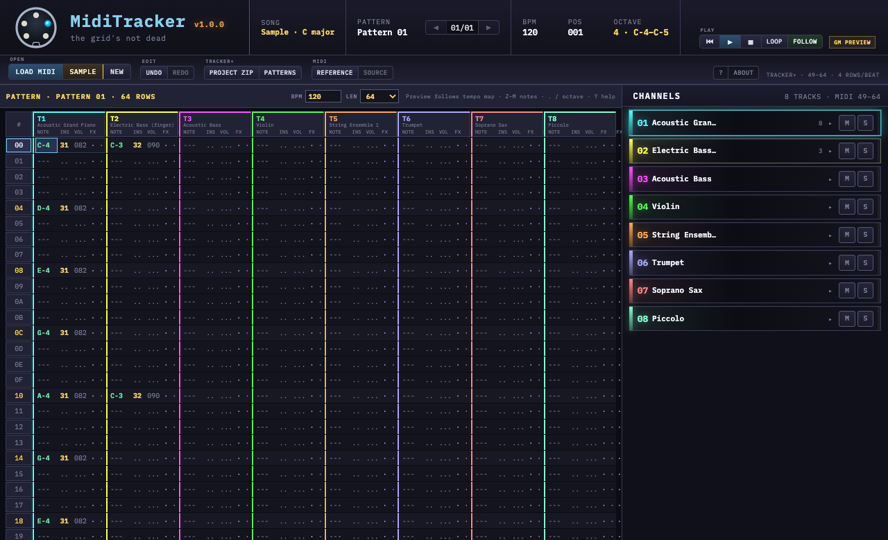
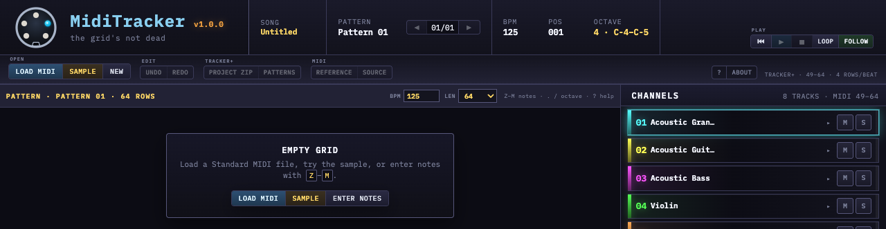
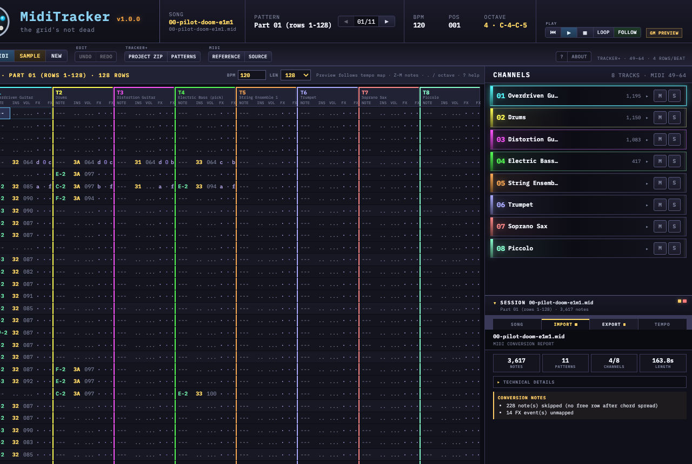
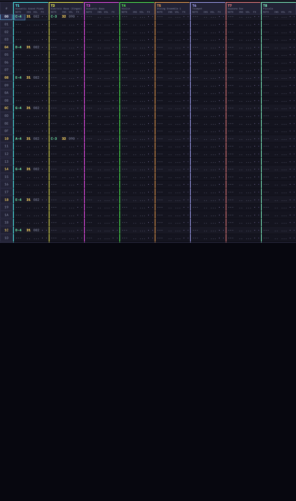
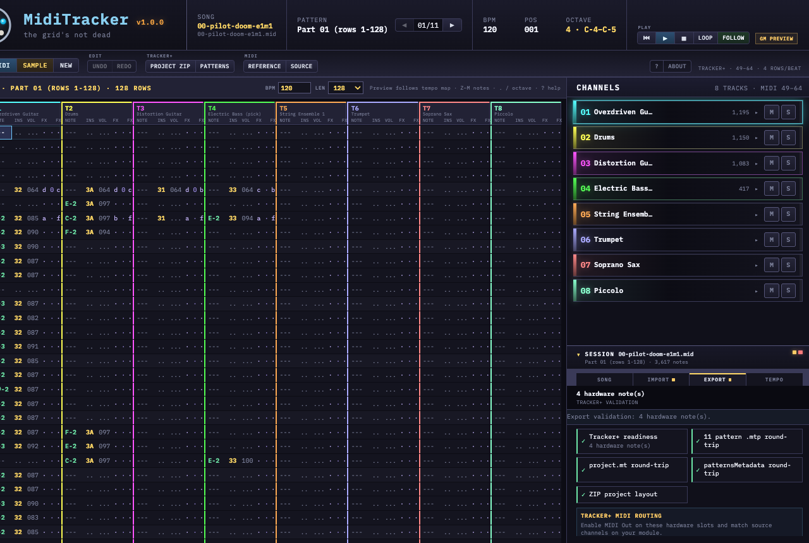

# MidiTracker

**Free, browser-based Standard MIDI → Polyend Tracker+ converter.** Import `.mid` / `.midi`, preview and edit patterns on the grid, validate exports with [`@polyend/tracker-lib`](https://github.com/polyend/tracker-lib), and download a full Tracker+ project ZIP — **no server, no account, data stays in your browser.**

[](https://david9up.github.io/miditracker/)
[](LICENSE)
[](https://github.com/david9up/miditracker/actions/workflows/test.yml)

<p align="center">
  <a href="https://david9up.github.io/miditracker/"><strong>Open live demo →</strong></a>
</p>

> Community tool — not affiliated with or endorsed by Polyend.

## Contents

- [At a glance](#at-a-glance)
- [Who it's for](#who-its-for)
- [Privacy](#privacy)
- [Workflow](#workflow)
- [Highlights](#highlights)
- [Quick start](#quick-start)
- [Screenshots](#screenshots)
- [Core library](#core-library)
- [Contact](#contact)

## At a glance

<p align="center">
  
</p>

<p align="center"><em>App shell — Load · Edit · Export with built-in sample pattern</em></p>

Tracker musicians often rebuild MIDI parts by hand in the grid. MidiTracker follows one **Load → Edit → Export** workflow in the browser: convert, tweak, validate, download.

## Who it's for

- **Tracker+ owners** — turn game rips, DAW exports, or legacy `.mid` into `.mtp` patterns and `project.mt`
- **Chiptune / retro composers** — quantize to 4 rows per beat, map CC and program changes to FX slots
- **Offline or air-gapped use** — run locally; nothing leaves the machine unless you save a file

## Privacy

- **No backend** — MIDI bytes and patterns never leave the browser unless you export
- **Source MIDI preserved** — re-download the original file from **MIDI → Source** after import
- **Local dev** — `npm run dev` serves the app on your machine only

## Workflow

| Step | Purpose |
|------|---------|
| **Load** | Drop or browse `.mid` / `.midi`, try **Sample**, or enter notes on a blank grid |
| **Edit** | Grid keyboard entry, undo/redo, song order, BPM, pattern length, GM SoundFont preview |
| **Export** | Tracker+ project ZIP, individual `.mtp` files, MIDI reference for hardware A/B |

<p align="center">
  
  &nbsp;&nbsp;
  
</p>

<p align="center"><em>Blank start · Session import report after MIDI conversion</em></p>

## Highlights

- **8-track mapping** — busiest MIDI channels → Tracker tracks; instrument slots **49–64** (hardware **48–63**)
- **Tempo map** — `T` FX on track 1, pattern splits at BPM changes
- **MIDI FX** — CC and program changes mapped to Tracker FX columns (a–f)
- **GM preview** — FluidR3_GM SoundFont audition in-browser (export remains authoritative for hardware)
- **Export validation** — tracker-lib round-trip on patterns, `project.mt`, and metadata before download
- **MIDI reference export** — grid-as-MIDI for A/B against the Tracker+ hardware
- **Keyboard grid** — Z–M note entry, undo/redo, `?` for help

## Quick start

**Try the demo:** [david9up.github.io/miditracker](https://david9up.github.io/miditracker/) → **Sample** for a demo pattern

**Run locally:**

```bash
git clone https://github.com/david9up/miditracker.git
cd miditracker
npm install
npm run dev
```

Open **http://127.0.0.1:5310**

```bash
npm run test:all        # unit + smoke + expert (402 tests)
npm run test:expert     # senior MIDI developer review suite only
npm run build           # production build → dist/
npm run build:pages     # GitHub Pages build (base /miditracker/)
npm run preview         # serve dist/ on port 5310
npm run release         # test:all + build
npm run screenshots     # refresh docs/screenshots/ (see docs/screenshots/README.md)
npm run validate:export -- <path>   # validate saved .mtp, .mt, or export ZIP
```

Deploy: **[DEPLOY.md](DEPLOY.md)** · Releases: **[CHANGELOG.md](CHANGELOG.md)**

## Screenshots

Images in `docs/screenshots/` are generated by Playwright, not hand-cropped:

```bash
npm run screenshots
```

Commit refreshed PNGs when the UI changes. See **[docs/screenshots/README.md](docs/screenshots/README.md)** for the file map.

<p align="center">
  
</p>

<p align="center">
  
</p>

## Core library

`src/lib/` is split into three areas:

- **`midi/`** — MIDI import, tempo map, FX mapping, pattern splitting
- **`export/`** — Tracker+ export, validation, save dialogs, tracker-lib I/O
- **root** — shared types, grid editing, playback, song session

```ts
import { importMidiBuffer, exportProjectZip } from './src/lib'

const buffer = await file.arrayBuffer()
const { song, report } = importMidiBuffer(buffer)
await exportProjectZip(song)
```

## References

- [tracker-lib docs](https://polyend.github.io/tracker-lib/)

## Contact

David Malcher — [dmalcher@fortinet.com](mailto:dmalcher@fortinet.com)

Bug reports and feature ideas: [GitHub Issues](https://github.com/david9up/miditracker/issues)

MIT — [LICENSE](LICENSE)
